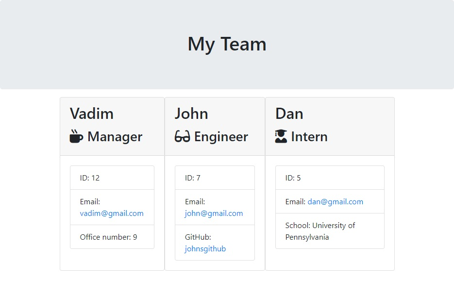

# employee-templates
This application is a node application which generates an html file containing information about employees. The user is presented with a prompt which lets them choose which type of employee to add: manager, engineer, or intern. Next the user is prompted to enter a name, id, email, and either an office number for managers, a github username for engineers, or a school name for interns. After entering the information the user is asked if they want to add another employee. Once the user answers no to adding another employee, an html file is created presenting the information that was entered.

[Github Repository](https://github.com/vadimsusername/employee-templates)

## Screenshot of Output
